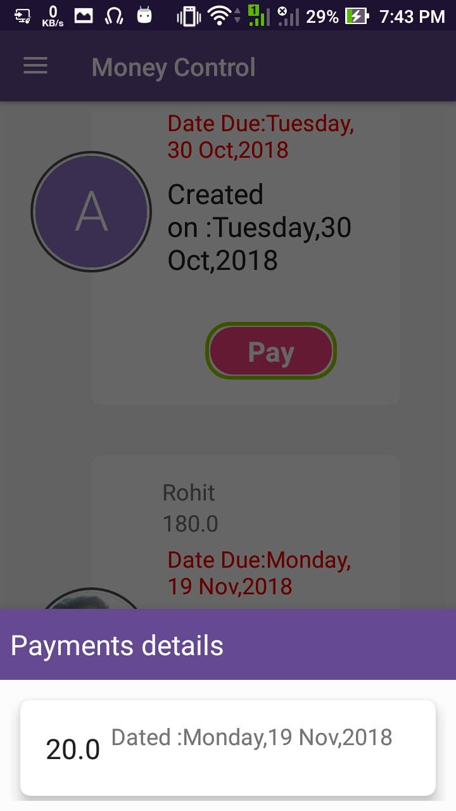
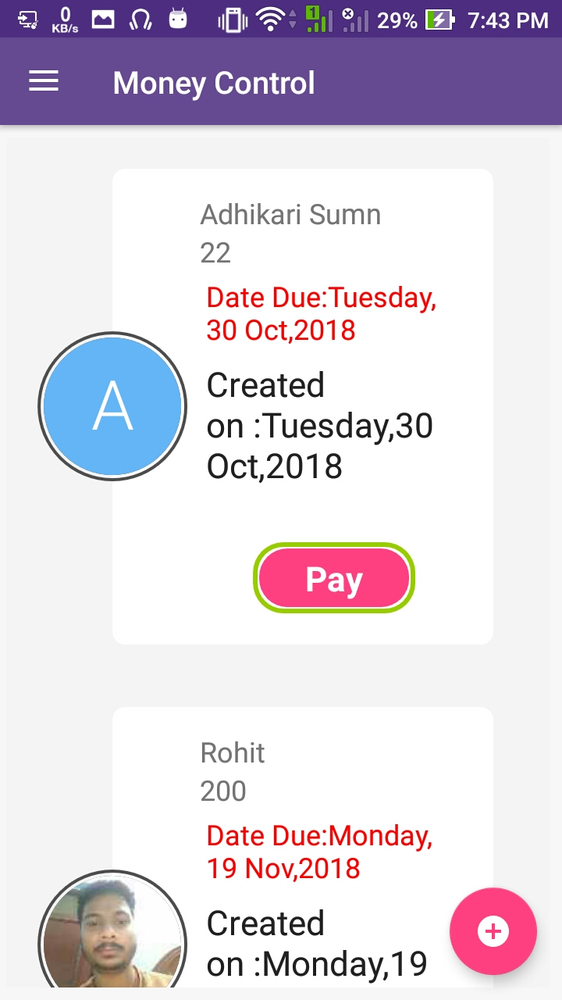
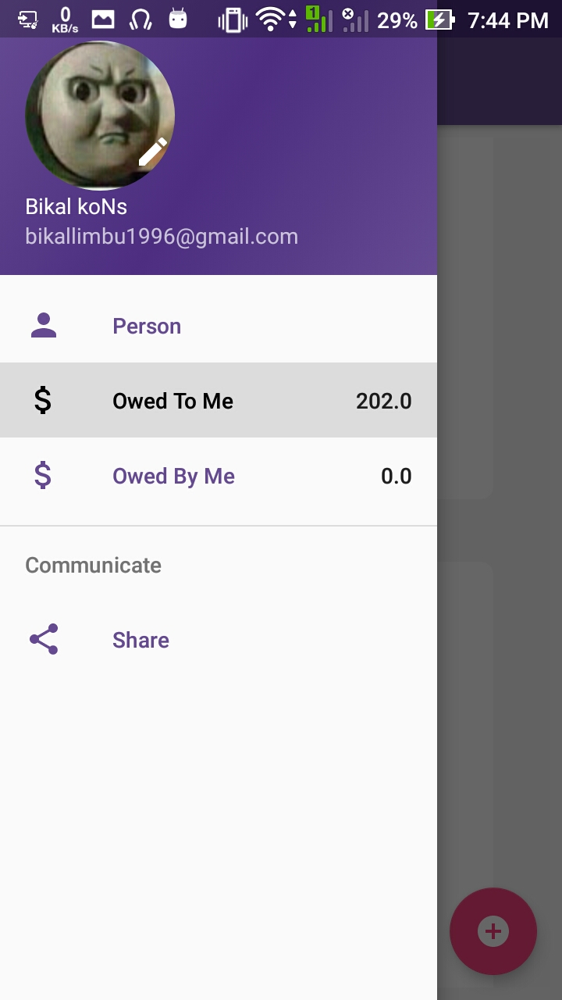
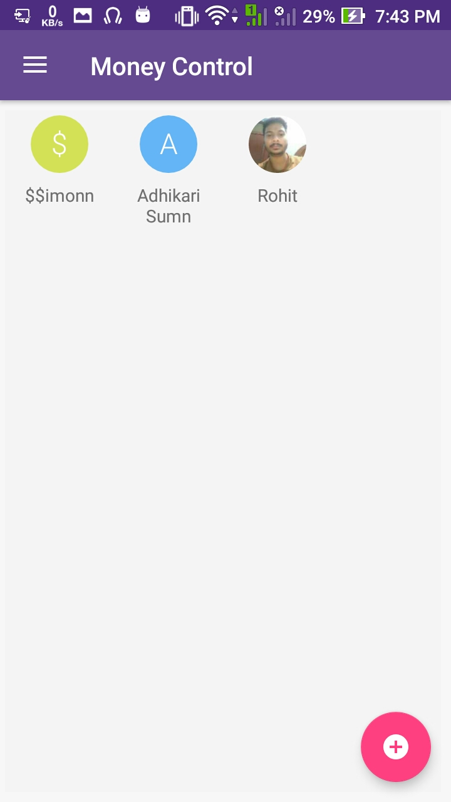

# Money Control
A personal app to store people that owe you money or you owe money to. :notebook: :Debt Management:

 

 

 

##### libraries:

    implementation 'androidx.legacy:legacy-support-v4:1.0.0'
    implementation 'com.google.android.material:material:1.1.0-alpha01'
    implementation 'androidx.constraintlayout:constraintlayout:2.0.0-alpha2'
    implementation 'androidx.recyclerview:recyclerview:1.0.0'
    implementation 'com.google.firebase:firebase-auth:16.0.5'
    implementation 'com.google.android.gms:play-services-auth:16.0.1'
    implementation 'com.google.firebase:firebase-core:16.0.4'
    implementation 'com.google.firebase:firebase-database:16.0.4'
    implementation 'com.firebaseui:firebase-ui-auth:4.1.0'
    testImplementation 'junit:junit:4.12'
    androidTestImplementation 'androidx.test:runner:1.1.0'
    androidTestImplementation 'androidx.test.espresso:espresso-core:3.1.0'
    implementation 'com.google.android.material:material:1.1.0-alpha01'
    implementation 'androidx.cardview:cardview:1.0.0'
    implementation 'de.hdodenhof:circleimageview:2.2.0'
    implementation 'com.squareup.picasso:picasso:2.71828'
    implementation 'com.github.bumptech.glide:glide:4.8.0'
    annotationProcessor 'com.github.bumptech.glide:compiler:4.8.0'
    implementation 'com.amulyakhare:com.amulyakhare.textdrawable:1.0.1'
    implementation 'com.github.karanchuri:PermissionManager:0.1.0'
    //contacts initial letter image
    implementation 'com.amulyakhare:com.amulyakhare.textdrawable:1.0.1'
    //search filter
    implementation 'com.miguelcatalan:materialsearchview:1.4.0'
    implementation 'com.firebase:firebase-jobdispatcher:0.8.5'
    //country code picker
    implementation 'io.michaelrocks:libphonenumber-android:8.9.5'

    implementation 'com.github.joielechong:countrycodepicker:2.1.8'
